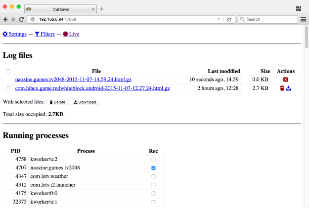

CatSaver
========

CatSaver is an Android service that automatically saves logcat. It also provides an HTTP server that allows developer to save and download logcat data without adb-connecting to the device. This is useful when:

* you want to test without attaching the cable, but want to retain the logs when it crashes unexpectedly
* you want to quickly obtain the crash log but another developer has adb-connected to the device
* you want to download a nicely-formatted crash log without including irrelevant information spewed by the system

Installation
------------

1. [Download](https://github.com/kennytm/CatSaver/releases) and install the APK
2. Start the CatSaver app on the device. The log collector and HTTP server should start automatically.
3. It is possible that the app does not have necessary permission to take logs. In this case, run the following from shell:

        adb shell pm grant hihex.cs android.permission.READ_LOGS

4. Visit `http://192.168.x.x:47689/` to get the logs.

CatSaver vs ACRA
----------------

CatSaver is an independent logcat dumping tool for development and testing, while [ACRA](https://github.com/ACRA/acra) is library to collect crash log after the app is released.

* CatSaver can save JNI logs.
* CatSaver doesn't need your app to be configured before using.
* ACRA can give you the crash log from a user you don't have access.
* ACRA doesn't need you to grant special permission to an app to work.

Todo
----

* Proper testing with coverage

License
-------

CatSaver is licensed in GPLv3 or later.

